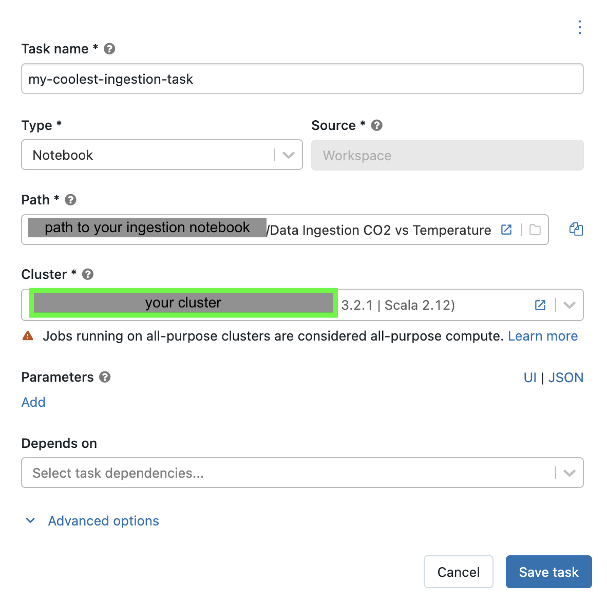
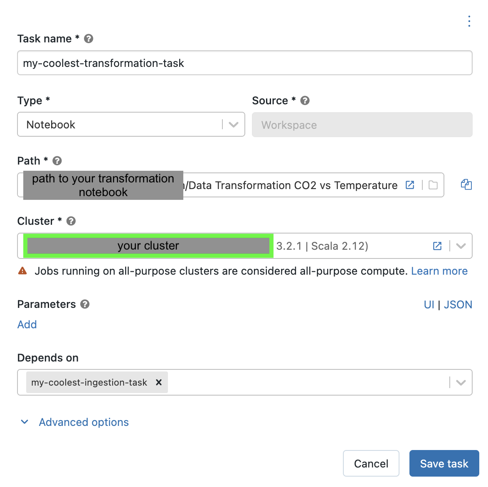
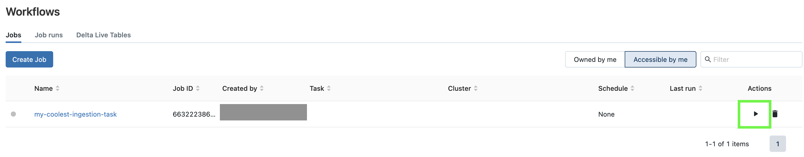

## Data Workflow
1. Set up a [Databricks Account](https://github.com/data-derp/documentation/blob/master/databricks/README.md) if you don't already have one
2. [Create a cluster](https://github.com/data-derp/documentation/blob/master/databricks/setup-cluster.md) if you don't already have one
3. On the sidebar menu, click the workflows icon

5. Create a task with a unique name for the Ingestion task (select your Ingestion notebook in your workspace and select YOUR cluster)

6. Once you have created the Ingestion task, click the PLUS button to add your Transformation task. 

7. Create a task with a unique name for the Transformation task (select your Transformation notebook in your workspace and select YOUR cluster)

8. Back in the workflows menu, click play to kick off your task

